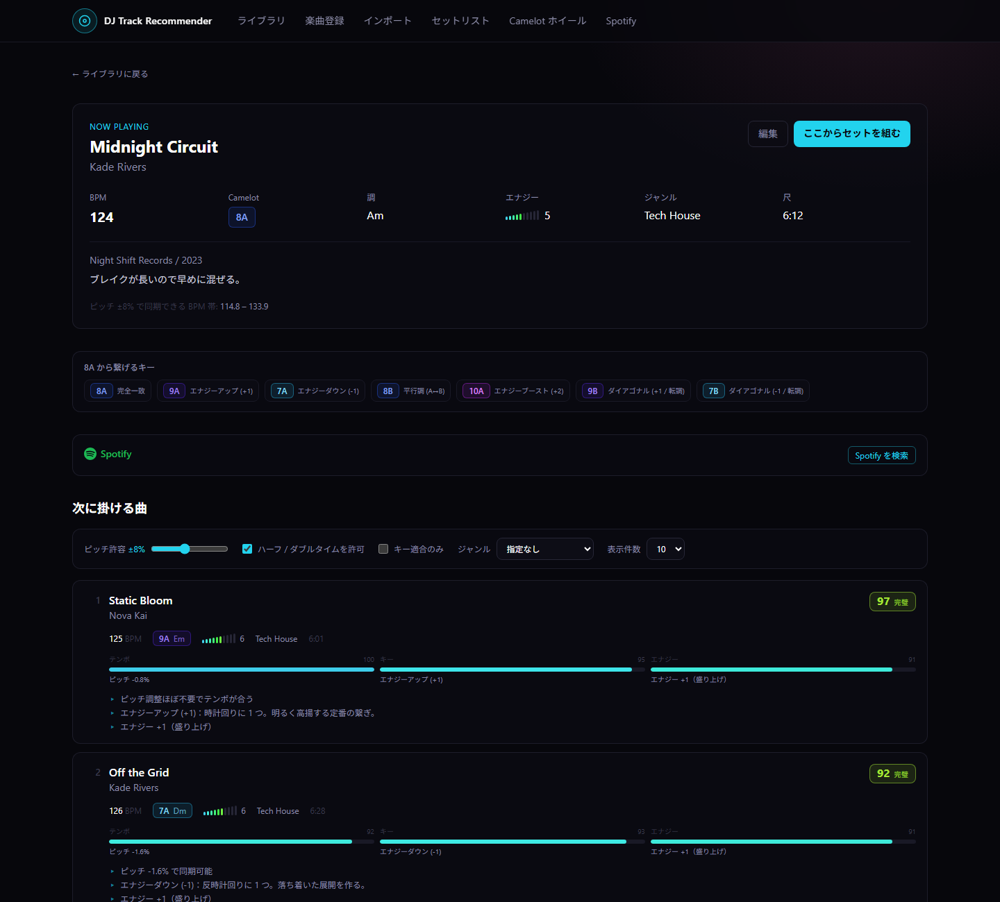
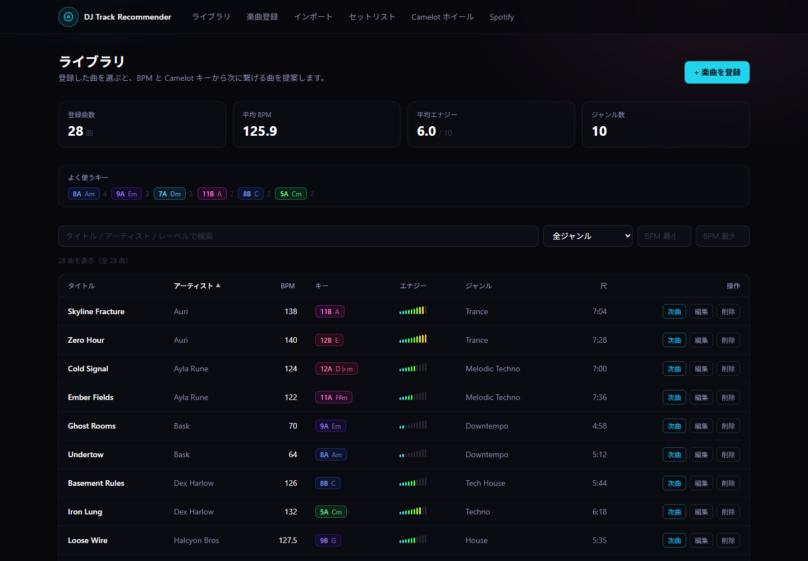
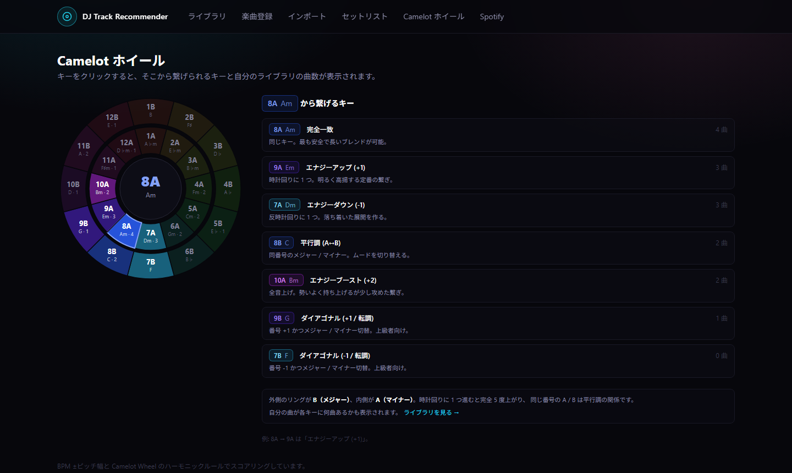

# DJ Track Recommender

[](https://github.com/mi-thic/dj-track-recommender/actions/workflows/ci.yml)
[](LICENSE)

BPM と Camelot キーから「次に掛ける曲」を提案する、DJ 向けの楽曲管理アプリ。

rekordbox のコレクションを取り込み、テンポ・ハーモニック適合・エナジー遷移の 3 軸でスコアリングして次の 1 曲を提案します。エナジーの流れを指定して、セットを丸ごと自動で組むこともできます。組んだセットは Spotify のプレイリストとして書き出せます。

| | |
|---|---|
| フレームワーク | Next.js 15（App Router） |
| 言語 | TypeScript |
| DB | PostgreSQL 16 |
| ORM | Prisma 6 |
| スタイル | Tailwind CSS 4 |
| 実行環境 | Docker / Docker Compose |

## 画面

### 次曲推薦

現在の曲に対して、テンポ・キー・エナジーの適合度と推薦理由を並べます。



### ライブラリ

BPM 帯・ジャンル・キーで絞り込み、並べ替えられます。



### Camelot ホイール

キーをクリックすると、繋げられるキーと自分のライブラリの曲数が出ます。



> 画面はサンプルデータ（`prisma/seed.ts` の架空の 28 曲）で撮影しています。

## 機能

- **楽曲登録** — タイトル / アーティスト / BPM / Camelot キー / エナジー / ジャンル / 曲尺 / レーベル / メモ。一覧からの編集・削除にも対応。
- **BPM 管理** — ピッチフェーダーの許容幅（既定 ±8%）を考慮したテンポ適合判定。ハーフタイム / ダブルタイム（例: 87 ↔ 174）も候補に含めます。
- **Camelot 管理** — 24 キーすべてを扱い、一般的な調表記（Am / C など）を併記。インタラクティブな Camelot ホイールでライブラリのキー分布を確認できます。
- **次曲推薦** — テンポ・ハーモニック適合・エナジー遷移を重み付き合成してスコア化（0–100）。推薦理由も表示します。
- **rekordbox インポート** — コレクション XML を読み込んで一括登録。キー表記は 3 種類すべて対応、プレイリスト単位の取り込みも可能です。
- **Spotify 連携** — 曲を Spotify と紐付けてジャケットを表示し、組んだセットをプレイリストとして書き出せます（BPM・キーは取得不可。後述）。
- **セットの自動生成** — 1 曲目とエナジーの流れ（山型・右肩上がり・一定・クールダウン）を選ぶと、テンポ・キーが繋がる曲を数手先まで読んで 1 本組みます。今のセットの続きだけを組むこともできます。エナジーと BPM の推移はグラフで確認できます。
- **セットリスト** — 1 曲目を選び、推薦を辿って流れを構築。おすすめに出ない曲も「ライブラリから選ぶ」で全曲から自由に追加でき、その場合も相性スコアと繋ぎの注意点（ピッチ範囲外・キーの衝突）を表示します。繋ぎごとのピッチ差・キー関係・エナジー変化を確認できます。保存したセットは一覧から開き直して並べ替え・削除・複製ができ、テキストや Spotify プレイリストとして書き出せます。
- **Docker 対応** — 開発用（ホットリロード）と本番用（standalone ビルド）の 2 構成。

## セットアップ

### 前提

どちらか一方があれば動きます。

- **Docker のみ**（Node 不要・推奨） → [Docker Desktop](https://www.docker.com/products/docker-desktop/)
- **ローカルの Node** → [Node.js 22 以上](https://nodejs.org/) と PostgreSQL 14 以上

### A. Docker で起動する（推奨）

環境変数ファイルを用意してから起動します（`.env` は Git 管理外なので、クローン直後は存在しません）。

```bash
cp .env.example .env
```

```bash
docker compose up --build
```

初回は自動で以下が行われます。

1. PostgreSQL 16 を起動
2. `prisma generate` → `prisma migrate deploy` でスキーマ適用
3. サンプル 28 曲を投入（`SEED_ON_START=true`）
4. Next.js 開発サーバーを起動

→ http://localhost:3000

停止と後片付け:

```bash
docker compose down
```

```bash
docker compose down -v
```

（`-v` を付けると DB のデータも削除されます）

### B. ローカルの Node で起動する

PostgreSQL を用意し、`.env` を作って `DATABASE_URL` を自分の環境に合わせます。

```bash
cp .env.example .env
```

```bash
npm install
```

```bash
npx prisma migrate deploy
```

```bash
npm run db:seed
```

```bash
npm run dev
```

### 本番相当で動かす

```bash
docker compose -f docker-compose.prod.yml up --build
```

`.env` で `POSTGRES_USER` / `POSTGRES_PASSWORD` / `POSTGRES_DB` を上書きできます。

> このアプリには認証がありません。手元以外で動かす前に [セキュリティ](#セキュリティ) を必ず読んでください。

## 推薦ロジック

`src/lib/recommend.ts` が 3 つのスコアを重み付き合成します（既定の重み: テンポ 0.45 / キー 0.40 / エナジー 0.15）。

### テンポ（`src/lib/bpm.ts`）

倍率 1x / 2x / 0.5x のそれぞれで、現在の曲に合わせるのに必要なピッチ調整量を計算し、最良のものを採用します。

- ピッチ差 1% 以内 → 100 点
- 許容幅（既定 ±8%）に近づくほど減点し、超えると 0 点
- ハーフ / ダブルタイムを使った場合は 0.85 倍

### キー（`src/lib/camelot.ts`）

Camelot Wheel 上の関係で判定します。

| 関係 | 例（8A から） | スコア |
|---|---|---|
| 完全一致 | 8A | 100 |
| エナジーアップ (+1) | 9A | 95 |
| エナジーダウン (−1) | 7A | 93 |
| 平行調 (A↔B) | 8B | 90 |
| エナジーブースト (+2) | 10A | 72 |
| ダイアゴナル (+1 転調) | 9B | 66 |
| ダイアゴナル (−1 転調) | 7B | 62 |
| それ以外 | — | 0 |

### エナジー

次曲のエナジーは「維持 〜 +1」が理想。そこから離れるほど減点します。

## セットの自動生成

セットを組む画面で 1 曲目を選び、「自動で組む」から使います。`src/lib/autoset.ts` が担当します。

### エナジーの流れ

| 形 | 目標エナジー |
|---|---|
| 山型 | 1 曲目から 7 割の位置で 9 まで上げ、最後は 1 曲目とピークの中間まで落とす |
| 右肩上がり | 最後の曲で 9 になるまで上げ続ける |
| 一定 | 1 曲目のエナジーを保つ |
| クールダウン | 最後の曲で 3 になるまで落とす |

次曲推薦はエナジーを「維持〜+1」が理想として採点しますが、それではクールダウンのセットが組めないため、自動生成では**曲ごとの目標エナジーにどれだけ近いか**で採点します（テンポ 0.40 / キー 0.35 / エナジー 0.25）。

### 数手先まで読む（ビームサーチ）

1 曲ずつ「その場で一番良い曲」を選ぶと、数曲先で繋げる曲が無くなる袋小路に入りやすくなります。そこで候補を常に 8 本並行して伸ばし、セット全体の合計が高いものを残します。実ライブラリ（84 曲・12 曲のセット 48 本）では、貪欲法より繋ぎの平均点が約 4 点高くなりました。

### 守る制約

- **テンポがピッチ範囲内で繋がること**（ハーフ / ダブルタイム含む）
- **1 曲でエナジーを 4 以上動かさない** — 減点だけにすると、キーとテンポが完璧な曲に負けてピーク直後に 9 → 2 のような急落が選ばれてしまうため
- **テンポを 1 曲目の ±6% 付近に保つ（既定、切り替え可）** — 各繋ぎがピッチ範囲内でも積み重なると大きくずれます。実ライブラリの 20 曲のセットでは、1 曲目から 10% 以上ずれた割合が 32/48 から 10/48 に減りました。ハーフ / ダブルタイムで繋いだ曲は、フロアで実際に鳴るテンポで判定します

テンポ帯の減点は曲順を選ぶときだけに使い、画面に出す「繋ぎの点数」には混ぜません。

ピッチ許容幅・ハーフ / ダブルタイム・キー適合のみ・ジャンルは、同じ画面の「次の候補」の設定をそのまま使います。

組んだ結果はセットに入り、セットの下の「エナジーと BPM の流れ」グラフで目標曲線と重ねて確認できます（← → キーで曲を移動）。「保存」を押すまでは DB に保存されません。

## rekordbox インポート

`/import` から、rekordbox の「ファイル > ライブラリ > コレクションを XML 形式で保存」で出力した XML を取り込めます。

### 読み取る項目

| rekordbox | このアプリ |
|---|---|
| `Name` / `Artist` | タイトル / アーティスト |
| `AverageBpm` | BPM |
| `Tonality` | Camelot キー |
| `Genre` / `Label` / `Year` | ジャンル / レーベル / リリース年 |
| `TotalTime` | 曲尺 |
| `Comments` | メモ |
| `Rating` / `Comments` | エナジー（設定による） |
| `TrackID` | 再インポート時の突き合わせ用に保持 |

### キー表記

rekordbox の 3 通りの表示設定すべてを受け付けます。

| 表記 | 例 | 変換先 |
|---|---|---|
| クラシック | `Am` / `F#m` / `Bb` | 8A / 11A / 6B |
| Alphanumeric | `8A` | 8A |
| Open Key | `1m` | 8A |

### エナジーの決め方

rekordbox にはエナジー項目が無いため、3 つから選べます。

- **一律の既定値** — 全曲同じ値（既定 5）
- **レーティングから換算** — ★1 → 2、★5 → 10。未評価は既定値
- **コメントから読む** — `Energy 7` / `エナジー7` / `E7` を検出。無ければ既定値

### 重複の扱い

`TrackID` を優先し、無ければ「タイトル + アーティスト」で既存曲を判定します。「更新する」を選んだ場合も、**アプリ側で育てた値は不用意に潰しません**。

- エナジー: 「一律の既定値」を選んでいるときは既存値を維持
- メモ: rekordbox 側のコメントが空なら既存値を維持

BPM またはキーが未解析の曲は取り込めません。取り込めなかった曲は理由付きで一覧表示されます。

書き出しの途中やコピーの中断で**途切れた XML はエラーになります**（途中までの曲だけが黙って取り込まれることはありません）。その場合は rekordbox から書き出し直してください。

### API から使う

```bash
curl -X POST http://localhost:3000/api/import/rekordbox \
  -F "file=@collection.xml" \
  -F "dryRun=true" \
  -F "energySource=rating"
```

`dryRun=true`（既定）なら解析結果を返すだけで書き込みません。他に `playlist`（`Crates > Peak Time` のようなパス）、`onDuplicate`（`skip` / `update`）、`defaultEnergy` を受け付けます。

## Spotify 連携

`/spotify` で設定します。**任意機能**なので、設定しなくてもアプリは問題なく動きます。

### 重要: BPM とキーは取得できません

Spotify は **2024 年 11 月 27 日に Audio Features / Audio Analysis を廃止**しました。`tempo`・`key`/`mode`・`energy` を返していたのがこの API です。2024 年 11 月 27 日時点で拡張クオータを持っていたアプリ以外は 403 になり、2025 年 5 月にはさらに厳格化されて拡張アクセスに月間アクティブユーザー 25 万人が必要になりました。新規アプリが取得できる見込みはありません。

したがって **BPM・Camelot キー・エナジーは rekordbox インポートか手入力で登録**してください。Spotify は補助的な役割です。

| 使えるもの | 使えないもの（403） |
|---|---|
| 検索、トラック/アルバム情報 | Audio Features（BPM・キー・エナジー） |
| プレイリストの作成・編集 | Audio Analysis |
| OAuth 認証 | Recommendations / Related Artists |

### セットアップ

1. [Spotify Developer Dashboard](https://developer.spotify.com/dashboard) で Create app
2. Redirect URI に `http://127.0.0.1:3000/api/spotify/callback` を登録
   （Spotify は `http://localhost` を許可しないため、ループバックは `127.0.0.1` を使います）
3. `.env`（未作成なら `cp .env.example .env`）に `SPOTIFY_CLIENT_ID` / `SPOTIFY_CLIENT_SECRET` を設定
4. `docker compose restart app` で再起動

手順はアプリの `/spotify` 画面にも表示されます。

### できること

- **曲の紐付け** — タイトルとアーティストで検索し、一致度の高いものを自動で紐付けます。紐付くとライブラリ一覧と詳細にジャケット画像が出ます。判定が微妙なものは「要確認」として候補を並べ、手動で選べます。
- **セットの書き出し** — セットリストビルダーから Spotify プレイリストを作成します。曲順はセットのままです。紐付いていない曲は除外され、件数が表示されます。

紐付けは Client Credentials（アプリ認証）だけで動くので、**検索と紐付けにアカウント連携は不要**です。プレイリスト作成のときだけ OAuth が必要になります。

### 使用エンドポイント（2026-02-11 の移行後）

Spotify は 2026 年 2 月 11 日にプレイリスト系のエンドポイントを変更しました。旧エンドポイントはスコープが揃っていても 403 を返します。

| 用途 | 使うもの | 旧（403 になる） |
|---|---|---|
| 作成 | `POST /v1/me/playlists` | `POST /v1/users/{user_id}/playlists` |
| 曲の追加 | `POST /v1/playlists/{id}/items` | `POST /v1/playlists/{id}/tracks` |

### マッチングの判定

`src/lib/spotify/match.ts` が文字バイグラムの Dice 係数でスコアリングします。`(Original Mix)` `- Extended Mix` `[Club Edit]` `feat. ...` やアクセント記号は比較前に落とします。

曲尺の差も見ており、**60 秒以上ずれている場合は自動紐付けしません**（6 分のクラブミックスに 3 分の Radio Edit が紐付くのを防ぐため）。

判定の挙動はテスト（`tests/spotify-match.test.ts`）で固定しており、認証情報なしで確認できます。

## API

| メソッド | パス | 説明 |
|---|---|---|
| `GET` | `/api/tracks` | 一覧。`?q=` で検索、`?genre=` で絞り込み |
| `POST` | `/api/tracks` | 楽曲登録 |
| `GET` | `/api/tracks/:id` | 1 曲取得 |
| `PATCH` | `/api/tracks/:id` | 更新 |
| `DELETE` | `/api/tracks/:id` | 削除 |
| `GET` | `/api/tracks/:id/recommendations` | 次曲推薦 |
| `POST` | `/api/import/rekordbox` | rekordbox XML の解析・インポート |
| `GET` | `/api/spotify/status` | 設定状況・連携状況・紐付け件数 |
| `GET` | `/api/spotify/connect` | Spotify の認可画面へリダイレクト |
| `GET` | `/api/spotify/callback` | OAuth コールバック |
| `POST` | `/api/spotify/disconnect` | 連携解除（曲の紐付けは残る） |
| `GET` | `/api/spotify/search` | 曲を検索（`title`+`artist` 指定なら一致度付き） |
| `POST` | `/api/spotify/match` | 未紐付けの曲を一括マッチング（`dryRun` 対応） |
| `POST` | `/api/spotify/playlists` | セットをプレイリストとして作成 |
| `POST` / `DELETE` | `/api/tracks/:id/spotify` | 曲の紐付け / 解除 |
| `GET` | `/api/setlists` | 保存済みセットの一覧（更新日の新しい順） |
| `POST` | `/api/setlists` | セットを保存（`name`, `notes`, `trackIds`。配列の順が曲順） |
| `GET` | `/api/setlists/:id` | セットを曲順どおりに取得 |
| `PATCH` | `/api/setlists/:id` | 名前・メモ・曲順のうち渡したものだけ更新 |
| `DELETE` | `/api/setlists/:id` | セットを削除（曲はライブラリに残る） |
| `POST` | `/api/setlists/:id/duplicate` | 「◯◯ のコピー」として複製 |
| `POST` | `/api/autoset` | セットを自動で組む（保存はしない。`trackIds`, `length`, `shape`, `keepTempo` など） |

推薦 API のクエリ:

| パラメータ | 既定値 | 説明 |
|---|---|---|
| `limit` | 10 | 件数（1–50） |
| `maxPitchPercent` | 8 | 許容ピッチ幅 % |
| `allowHalfDouble` | true | ハーフ / ダブルタイムを許可 |
| `keyCompatibleOnly` | false | キー適合する曲のみ |
| `minScore` | 30 | 下限スコア |
| `genre` | — | ジャンル絞り込み |
| `excludeIds` | — | 除外する ID（カンマ区切り） |
| `weightBpm` / `weightKey` / `weightEnergy` | — | 重みの上書き（0–1） |

例:

```bash
curl "http://localhost:3000/api/tracks/<id>/recommendations?limit=5&keyCompatibleOnly=true"
```

## ディレクトリ構成

```
prisma/
  schema.prisma          Track / Setlist / SetlistItem / SpotifyAccount モデル
  migrations/            マイグレーション
  seed.ts                サンプル 28 曲
src/
  app/
    page.tsx             ライブラリ（一覧・検索・統計）
    tracks/new/          楽曲登録
    tracks/[id]/         楽曲詳細＋次曲推薦
    tracks/[id]/edit/    編集
    import/              rekordbox インポート
    setlist/             セットを組む（?id= で保存済みを開く）
    setlists/            保存済みセットの一覧
    camelot/             Camelot ホイール
    spotify/             Spotify 連携設定・一括マッチング
    api/tracks/          REST API
    api/import/          インポート API
    api/spotify/         Spotify API
    api/setlists/        セットリスト API
    api/autoset/         自動生成 API
  components/            UI コンポーネント
  hooks/                 推薦取得フック
  lib/
    camelot.ts           Camelot Wheel ロジック
    bpm.ts               テンポ適合
    recommend.ts         推薦エンジン（純粋関数）
    autoset.ts           セットの自動生成（純粋関数）
    rekordbox.ts         rekordbox XML パーサ
    setlists.ts          セットリストの保存（サーバー専用）
    genres.ts            ジャンル候補
    library.ts           ライブラリ集計（サーバー専用）
    validation.ts        zod スキーマ
    types.ts             DTO 変換
    format.ts            曲尺の表示・パース
    prisma.ts            Prisma クライアント
    spotify/
      config.ts          環境変数
      auth.ts            OAuth・トークン管理
      api.ts             Web API ラッパー
      match.ts           曲名マッチング（純粋関数）
tests/                   単体テスト（node:test）
docker/
  migrate.sh             起動時のスキーマ適用 / シード
docs/
  screenshots/           README 用のスクリーンショット
```

## テスト

```bash
docker compose exec app npm test
```

ローカルの Node で動かしている場合は `npm test` です（テストファイルの glob 指定に Node 21 以上が必要なため、前提を Node 22 以上にしています）。

DB や外部 API を使わない純粋関数を対象にした単体テストです。CI でも毎回実行しています。依存を増やさないよう Node 標準のテストランナー（`node:test`）と `tsx` で動かしています。

| ファイル | 対象 |
|---|---|
| `camelot.test.ts` | Camelot の 7 種類の関係判定、12↔1 の折り返し、調表記との相互変換（24 キーの往復） |
| `bpm.test.ts` | ピッチ調整量と符号、許容幅での減点、ハーフ / ダブルタイム |
| `recommend.test.ts` | 除外・絞り込み・下限スコア、エナジー遷移、重み変更で順位が変わること |
| `autoset.test.ts` | 貪欲法が袋小路で止まる例をビームサーチが解くこと、エナジーの急落を選ばないこと、テンポ帯（ダブルタイムの判定含む）、各形の目標曲線 |
| `rekordbox.test.ts` | 3 種類のキー表記、コメント / レーティングからのエナジー、XML の解析と途中で切れたファイルの検出 |
| `spotify-match.test.ts` | ミックス表記の正規化、自動紐付けの可否、Radio Edit を本家より下に並べること |

## セキュリティ

**このアプリには認証がありません。** 手元の 1 台で自分のライブラリを管理する前提の設計です。

- API はすべて無認証です。到達できる人は誰でも楽曲を追加・編集・削除でき、Spotify を連携していればそのアカウントにプレイリストを作成できます
- 開発用の `docker-compose.yml` はアプリを `0.0.0.0:3000` で公開します。同じネットワークの他の端末から見える状態です
- PostgreSQL は `127.0.0.1:5432` にのみ公開しています（ホストの GUI クライアント用）

インターネットから到達できるサーバーで動かす場合は、最低限これらが必要です。

1. **認証を追加する** — リバースプロキシの Basic 認証、または Next.js の middleware
2. **`POSTGRES_PASSWORD` を変更する** — `djpass` は開発用の既定値です
3. **HTTPS を前段に置く** — あわせて Spotify のリダイレクト URI も HTTPS のものに登録し直します

Spotify のアクセストークンとリフレッシュトークンは `SpotifyAccount` テーブルに平文で保存しています。単一ユーザーのローカル用途を想定した割り切りです。共有環境で使う場合は暗号化を追加してください。

## 既知の脆弱性アドバイザリ

`npm audit` に残るものは、いずれも意図的に据え置いています。現状は次で確認できます。

```bash
docker compose exec app npm audit
```

| パッケージ | 経路 | 対応 |
|---|---|---|
| `postcss` | `next` にバンドルされたもの | 解消には Next.js 16 へのメジャー更新が必要。ビルド時のみ使われ、攻撃者が CSS を注入できる経路が無いため据え置き |
| `deepmerge-ts` → `@prisma/config` → `prisma` | devDependency（Prisma CLI） | npm の提案は `prisma@6.12.0` へのダウングレード。ローカル CLI の設定マージでの stack exhaustion であり、ダウングレードの方が不利益が大きいため据え置き |

critical だった `next` の RCE 系 advisory を避けるため、`next` は `^15.5.25` を要求しています。`sharp` も修正版を使います。

## 補足

- `src/generated/prisma` は `prisma generate` で生成されます（Git 管理外）。初回は `npm install` の postinstall で自動生成されます。
- `npm run build` は型チェックを兼ねています。ホストに Node.js を入れていない場合は次で実行できます。

  ```bash
  docker compose run --rm --no-deps -e NODE_ENV=production app npm run build
  ```

  開発用イメージは `NODE_ENV=development` のため、`-e NODE_ENV=production` を付けないと `/404` のプリレンダーで失敗します。`run` は別コンテナで `.next` も別なので、開発サーバーを起動したままで構いません（起動中のコンテナで `docker compose exec app npm run build` を実行すると `.next` を共有して開発サーバーの表示が壊れます。その場合は `docker compose restart app` で復旧します）。

- `package-lock.json` は glibc 環境で生成しています。`lightningcss` などのネイティブバイナリは libc ごとに別パッケージで、musl (Alpine) 上で生成すると glibc 用が記録されず、Ubuntu や macOS で `npm ci` したときにビルドが落ちます。Docker のベースイメージを Debian (`node:22-slim`) にしているのはこのためです。
- 日本語など非 ASCII 文字を含むパスに置くと、環境によっては Docker のバインドマウントが認識されないことがあります。その場合は `C:\dev\dj-app` のような ASCII のパスに移動してください。
- 推薦と自動生成は候補全件を走査する実装です。数千曲規模までは問題ありません（自動生成は 3,000 曲から 30 曲のセットを組んで、手元の計測で約 0.15 秒）。それ以上になる場合は BPM 帯での事前絞り込みを入れてください。

## ライセンス

[MIT License](LICENSE) © 2026 mi-thic

### 依存ライブラリについて

依存 178 パッケージ（OS 別のネイティブバイナリを含む）のうち大半は MIT / Apache-2.0 / ISC / BSD の許諾型ライセンスで、本プロジェクトのライセンス選択を制約するものはありません。以下だけ補足します。

| パッケージ | ライセンス | 補足 |
|---|---|---|
| `@img/sharp-libvips-*` / `@img/sharp-win32-*` など | LGPL-3.0-or-later を含む | sharp のプリビルドバイナリ。`next/image` 用の optional 依存で、本アプリはジャケット表示に素の `` を使っているため実行時には利用しません |
| `lightningcss` | MPL-2.0 | Tailwind CSS のビルド時のみ使う開発依存 |
| `caniuse-lite` | CC-BY-4.0 | ブラウザ対応データ |

**Docker イメージを再配布する場合**は、イメージ内に LGPL のバイナリが含まれるため、該当ライセンスの表記を同梱してください（ソースコードのみの配布であれば不要です）。

### 免責・帰属表示

本プロジェクトは個人が開発した非公式のツールであり、以下のいずれとも提携・承認・後援の関係にありません。

- **Spotify** — Spotify は Spotify AB の商標です。アプリ内では、Spotify のコンテンツを表示する画面（`/spotify`、ライブラリ一覧、楽曲詳細）に Spotify ロゴによる帰属表示を出し、楽曲は Spotify のページへリンクしています。本アプリを利用するには、各自が [Spotify Developer Dashboard](https://developer.spotify.com/dashboard) でアプリを登録し、Spotify Developer Terms of Service に同意する必要があります。本アプリの MIT ライセンスは Spotify の利用規約を上書きするものではありません。楽曲のメタデータおよびジャケット画像は Spotify から提供されるものであり、表示される楽曲は Spotify 上のページへリンクしています。
- **rekordbox** — rekordbox は AlphaTheta Corporation の商標です。本アプリはユーザーが書き出した XML ファイルを読み取るだけで、rekordbox 本体やそのデータベースには一切アクセスしません。

サンプルデータ（`prisma/seed.ts`）の楽曲名・アーティスト名はすべて架空のものです。
